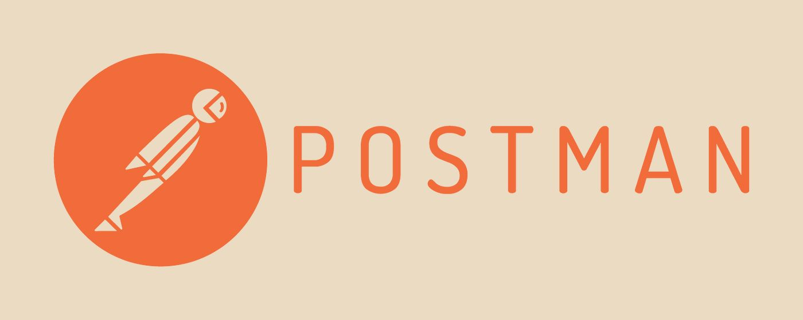

<!-- _class: first-page -->
<!-- header: '
Testning - tisdag 7 och onsdag 8 maj 2024
' -->

# &nbsp;Testning
## Avslutning enhetstester, GitHub Actions, samt introduktion till API/endpoint-testning med Postman

---
<!-- paginate: true -->
<!-- _class: tight-list big-margins -->

# Enhetstester och Continuous Integration av dem med GitHub Actions
Eftersom vi spelar in veckans lektion har vi en mindre detaljerad presentation än annars! 
- [Du hittar videoinspelningarna här](https://sys23m-jensen.lms.nodehill.se/article/videoinspelningar-tisdag-7-maj-och-onsdag-8-maj-distansundervisning) efter lektionsdagens slut.
- Hur har det gått med läxan - att skriva enhetstester och metoder för dem enligt TDD?
- Förslag till effektivisering av enhetstester:
  - [1000 mock-användare med BCrypt-krypterade lösenord](https://sys23m-jensen.lms.nodehill.se/article/1000-mock-anvandare-med-bcrypt-krypterade-losenord)
  - [C# - Primary Constructors - en välkommen nyhet som ofta kan korta ner din kod](https://sys23m-jensen.lms.nodehill.se/article/c-primary-constructors-en-valkommen-nyhet-som-ofta-kan-korta-ner-din-kod)
  - [Dotnet run script - ett enklare sätt att starta olika tester etc](https://sys23m-jensen.lms.nodehill.se/article/dotnet-run-script-ett-enklare-satt-att-starta-olika-tester-etc)
- GitHub Actions för Continuous Integration:
  - [GitHub Actions - en introduktion](https://sys23m-jensen.lms.nodehill.se/article/github-actions-en-introduktion)
  - [Ett GitHub-Actions-workflow för att köra unit-tester med vår kodbas](https://sys23m-jensen.lms.nodehill.se/article/ett-github-actions-workflow-for-att-kora-unit-tester-med-var-kodbas)

---
<!-- paginate: true -->
<!-- _class: tight-list big-margins -->

# API/endpoint-testning med Postman
- Hur fungerar ACL? Genomgång allmänt och utifrån vår kodbas och databas.
- [Postman för endpoint/api testning - en introduktion](https://sys23m-jensen.lms.nodehill.se/article/postman-for-endpoint-api-testning-en-introduktion)
- Övning - sätt upp nya databastabeller och ge dem korrekta ACL-rättigheter. Testa i Postman!

---

<!-- paginate: true -->
<!-- _class: tight-list big-margins -->

# Under onsdag 8 maj
- Vi kommer att fortsätta med Postman och automatisera ett antal olika teter.
- Vi kommer att lära oss köra Postman-testerna med verktyget Newman.
- Vi väntar med GitHub Actions-integration av dessa tester till torsdag 16 maj.

