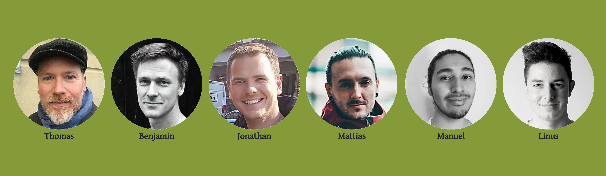
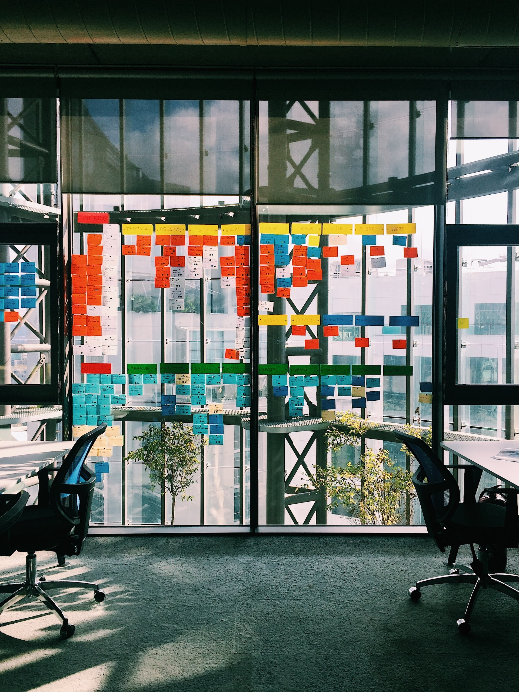
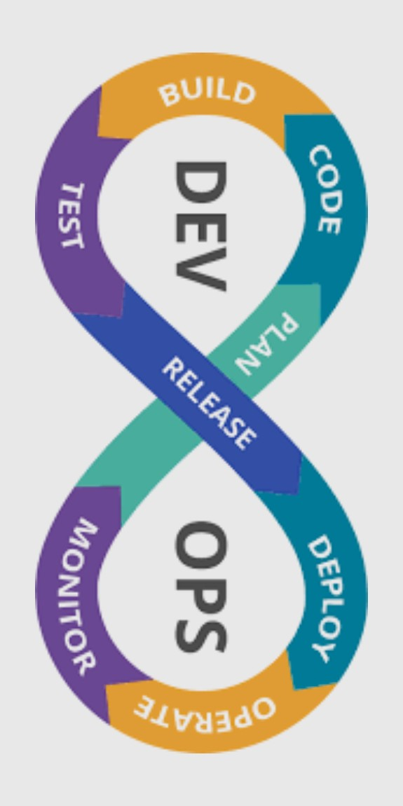

<!-- _class: first-page -->
<!-- header: '
Testning &ndash; introduktion, 2024-04-30
' -->

# &nbsp;Introduktion till kursen Testning
## Kursplanering, olika typer av tester, testprocessen, arbetsmetoder & roller

---

<!-- paginate: true -->
<!-- _class: tight-list -->

# Din lärare: Thomas Frank
Thomas Frank har arbetat med IT- och webbutveckling i över 25 år – webb, e-böcker och digitala läromedel – bl.a. som **Digital Development Manager** på Studentlitteratur och som konsult på Axis Communications, i en rådgivande roll kring övergripande webbsystemarkitektur.

### Några snabba fakta
- Examen inom Informatik (IT) och medie- och kommunikationsvetenskap från Lunds Universitet. 
- Har undervisat på YH-nivå sedan 2013, ca 15 000 lektionstimmar, bl.a. på många systemutvecklar- och testutbildningar.
- CEO för Node Hill, ett företag som uteslutande arbetar med IT-utbildning på yrkeshögskole- och högskolenivå.
- Pappa till tre barn, varav två är vuxna och utflugna.
- Sambo med Wanja och husse till katten Moshi.
- Fritidsintressen: Att programmera. 😉 Samt även att spela gitarr, sjunga och skriva låtar. 

---

<!-- _class: big-margins tight-list nodehill-faces -->

# Vem är Node Hill?
Node Hill sysslar med IT-utbildningar. Vi arbetar som leveran­törer till olika yrkes­hög­skolor och högskolor/universitet. Saker vi brinner för och tycker är viktiga:

- hänsyn till varje studerandes unika förutsättningar
- problembaserat lärande i agila team 
- verklighetsnära problemlösning.

[Läs mer på Node Hills webbplats](https://www.nodehill.com)

---

<!-- paginate: true -->
<!-- _class: tight-list -->

# Kursen Testning
Kursen Testning är en fyraveckors kurs (20 yhp) som ska ge en introduktion till testning. Thomas kommer att lägga fokus på att lära ut vanligen använda automatiserade testmetoder:
- *Enhetstester* (även kallade *unit tester*) 
- *API/endpoint-tester* av REST-api:er
- *UI/gränssnittstestning* - automatiserad testning av gränssnitt
- *Continuous Integration* (CI) - att automatiskt köra automatiserade tester varje gång kodbasen förändras.

Utöver detta tittar vi bl.a. på olika begrepp, arbetsmetoder och roller kring testning, samt manuell utforskande testning.

Jensen har bestämt sig för att examination ska ske via en tenta, men vi kommer att genomföra praktiska övningar i form av läxor som man sedan länkar till när man gör denna tenta, eftersom praktiska färdigheter inte går att mäta med teorifrågor.

*Detaljerad info och schema* finns i [kursplaneringen som du hittar här.](https://sys23m-jensen.lms.nodehill.se/article/kursplanering-testning-jensen-sys23)

---

<!-- paginate: true -->
<!-- _class: tight-list -->

# Program vi kommer att behöva
- En kodeditor. Thomas rekommenderar starkt att du använder editorn [Visual Studio Code](https://code.visualstudio.com). Den har fördelen att vi kan arbeta med såväl C#-kod som JavaScript-kod på ett smidigt sätt.
- [C# Dev Kit](https://marketplace.visualstudio.com/items?itemName=ms-dotnettools.csdevkit) för Visual Studio Code.
- [Node.js](https://nodejs.org/en) som vi använder tillsammans med olika moduler/paket för gränssnittstestning. (Ladda hem senaste LTS-versionen.)
- [PostMan](https://www.postman.com/downloads) för API/endpointtestning. (Installera på datorn, kör *inte* webbversionen.)
- [SQLiteStudio](https://sqlitestudio.pl/) - en grafisk editor för SQLite-databaser.
- [Git](https://git-scm.com), ett [GitHub](https://github.com)-konto och, om du vill, ett grafisk gränssnitt för Git (som t.ex. [GitHub Desktop](https://desktop.github.com)).

*Installera dessa program så snart som möjligt, under egentid, så slipper du sitta och krångla med det under lektionerna.* Men fråga gärna Thomas om du får problem med någon installation!

Utöver detta kommer vi att använda oss av olika kodbaser/kodexempel, och då installera olika NuGet-paket för C# och npm-paket för Node.js.

---

<!-- paginate: true -->
<!-- _class: tight-list -->

# Om testning
## Länkar till artiklar på vår blogg
- [Olika typer av testning](https://sys23m-jensen.lms.nodehill.se/article/olika-typer-av-test) - beskrivning av några vanliga typer av test.
- [Vanliga typer av automatiserad testning](https://sys23m-jensen.lms.nodehill.se/article/vanliga-typer-av-automatiserad-skriptad-testning), samt kort förklaring av vad TDD (Test Driven Development) och BDD (Behavior Driven Development) är.
- [TDD som arbetsmetod](https://sys23m-jensen.lms.nodehill.se/article/test-driven-development-tdd-intro) - historik, arbetsflöde, för- och nackdelar.
- [BDD som arbetsmetod](https://sys23m-jensen.lms.nodehill.se/article/bdd-och-gherkin-cucumber-intro) - samt en introduktion till scenariebeskrivningar med Gherkin och vad Cucumber är.
## Hur kommer vi att använda arbetsmetoderna?
- Vi kommer att prova på utforskande testning (*exploratory testing*) redan första dagen! Detta är en manuell testform, som dock ofta även är nödvändig innan man kan gå vidare och skriva automatiserade testter.
- Vi kommer att arbeta enligt TDD när vi skriver unit tester och enligt BDD när vi, så småningom, skriver gränssnittstester.

---
<!-- paginate: true -->
<!-- _class: super-tight-list -->

# Vad är Continuous Integration?
- I dag versionshanteras en merpart av all utvecklad kod, oftast med git. Oftast sätter man även upp regler för att kod måste granskas innan den kan läggas till i vissa git-brancher, via s.k. *pull requests*.
- Versionshanteringen i sig, och att den ska vara löpande (dvs. commits sker dagligen), är en del av det vi kallar *Continuous Integration* - **CI**.
- Till **CI** räknas även att få automatiserade tester (som enhetstester, endpointtester och gränssnittstester) att köra varje gång *pull requests* sker till vissa brancher (t.ex. huvudbranchen för utveckling, ofta kallad *dev*).
- Innan testerna kan köras måste även koden kompileras/"byggas". Så även detta led behöver vara automatiserat.
- Genom att köra automatiserade tester vid varje *pull request* går det snabbt att se att koden inte försämrats och buggar uppstått under utvecklingen. Detta är alltså en typ av *regressionstestning*.
- Det finns olika verktyg för att sätta **CI**-flöden/"pipelines". Allt populärare blir att de är inbyggda i den molntjänst man väljer för git, t.ex. har GitHub ett system som kallas **GitHub Actions**, som vi ska använda oss av under kursen.
- Det går även att bygga flöden för att automatiskt publicera ett projekt på en (webb)server efter att testerna har körts i en viss branch, vanligen projektets main/live-branch. Detta kallas *Continuous Deployment* - **CD**.
---
<!-- paginate: true -->
<!-- _class: tight-list -->

# Roller inom testning
Det finns i olika yrkesroller i vilka testning ingår:
- *Utvecklare* skriver ofta enhetstester. På arbetsplatser där det inte finns anställa mjukvarutestare (eller där dessa saknar teknisk kompetens) skriver de även endpointtester och gränssnittstester, samt *CI*-flöden.
- *Mjukvarutestare* är ett yrke i förändring. Från att för 10-20 år sedan främst sysslat med manuella tester, både utforskande och utifrån olika protokoll och scenarier, är det nu allt fler mjukvarutestare som kan programmera och skriva automatiserade tester. Ibland kallas de som har sådana kunskaper *tekniska testare*.
- *Testledare* kallas den person som har huvudansvaret för testning i ett mjukvaruprojekt. Hen leder ofta ett team av testare och tar ansvar för att utforma regler, rutiner och flöden kring hur testningen bör genomföras.
- *DevOps Engineers* har ofta djup kunskap om *CI*- och *CD*-flöden och hjälper utvecklare och testare att sätta upp sådana flöden.
- *Andra*, t.ex. chefer och projektledare, kan också vara involverade i krav- och testprocessen. T.ex. genom att man är med och tar fram scenarier enligt BDD.

---
<!-- paginate: true -->
<!-- _class: tight-list -->

# Övning: Utforskande testning
Från [Wikipedia: Utforskande testning](https://sv.wikipedia.org/wiki/Utforskande_testning):

>"*Utforskande testning handlar om att se hur produkten fungerar, och utifrån det ställa frågor om hur den hanterar svåra och enkla fall. Denna testning är i hög grad beroende av testarens skicklighet i att hitta på tester och upptäcka felaktigheter. Ju mer testaren vet om produkten och olika testmetoder, desto mer effektiv blir testningen.*" 

Vi ska göra en övning där vi utför utforskande testning av två olika tågbolags bokningsystem på webben: **SJ** och **Snälltåget**.

[Instruktioner för övningen hittar du på vår blogg!](https://sys23m-jensen.lms.nodehill.se/article/ovning-utforskande-testning-tagbokning)

---

<!-- paginate: true -->
<!-- _class: tight-list big-margins whats_next-->

# Inför torsdag 2 maj 2024
- Vi kommer att arbeta med att skriva enhetstester enligt TDD (dvs. koden för testerna skrivs före programkoden).
- Node Hills praktikant, Max, har satt ihop en trevlig README-fil och ett exempelrepo kring hur man kommer igång med unit testing med C#, [som du hittar här](https://github.com/Svenpaj/simple-setup-unitTestCsharp).
- Thomas har tagit fram en kodbas med databas, backend (baserat på [Microsoft Minimal APIs](https://learn.microsoft.com/en-us/aspnet/core/fundamentals/minimal-apis/overview?view=aspnetcore-8.0)) och frontend, som vi kommer att arbeta med löpande under kursen. [Den hittar du här](https://github.com/ironboy/TestCSharpApi) och det är bra om *du kopierar (eller forkar) den till ett eget repo inför torsdagen*. Det finns en README-fil som främst förklarar hur REST-api:t fungerar. (Notera dock att frontend inte använder REST-api:t än.)

