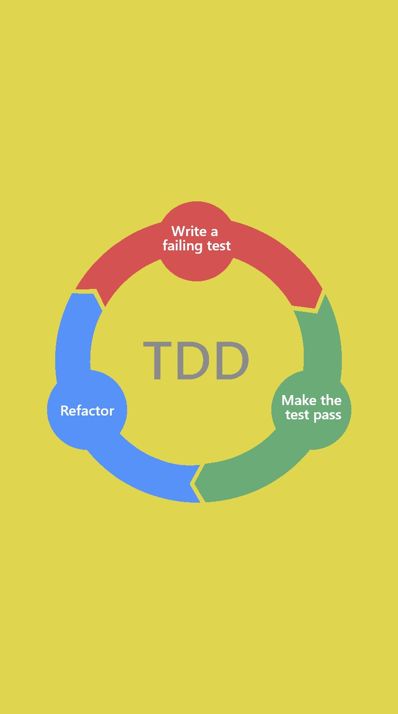
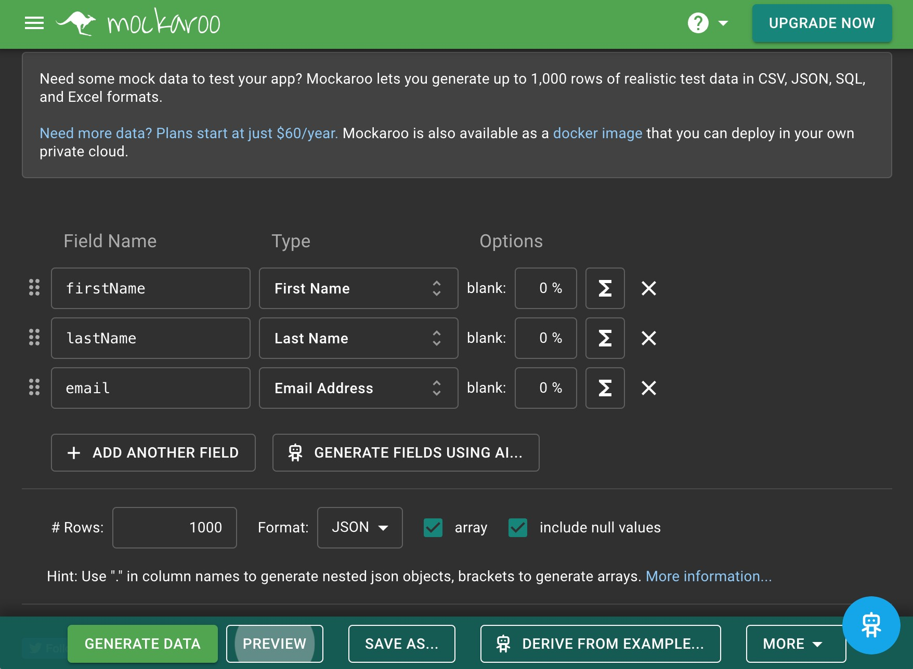

<!-- _class: first-page -->
<!-- header: '
Testning &ndash; Enhetstester, 2024-05-02
' -->

# &nbsp;Testning
## Att skriva enhetstester med TDD som arbetsmetod, samt Continuous Integration med Github Actions

---
<!-- paginate: true -->
<!-- _class: tight-list big-margins -->

# Övergripande mål för dagen
- Utgå från [följande kodbas]((https://github.com/ironboy/TestCSharpApi)) som du bör ha kopierat till ett eget repo!
- Du ska lägga till ny funktionalitet, i form av ett antal olika metoder i backend.
- De nya metoderna ska vara enhetstestade!
- Enhetstesterna ska köras automatiskt vid ändringar i kodbasen.

---
<!-- paginate: true -->
<!-- _class: tight-list -->

# Vi ska arbeta enligt TDD och lära oss använda GitHub Actions

När vi skriver de nya metoderna ska vi följa arbetsmetoden **TDD** ([Test Driven Development](https://marsner.com/blog/why-test-driven-development-tdd/)), dvs:
  1. Först skapar du en "tom" metod – med bara [metodsignaturen](https://www.c-sharpcorner.com/UploadFile/puranindia/method-signatures-in-C-Sharp/) och en tom kropp – sånär som på att vi behöver returnera ett fast värde av rätt typ från början (eller null).
  2. Därefter skriver du ett (eller flera) test som anropar metoden och testar att den utför det arbete den ska – returnerar rätt output i förhållande till dess input. Detta test kommer givetvis att fallera, vilket är meningen!
  3. Slutligen skriver du klart metoden. Under förutsättning att testet är väl utformat/skrivet är metoden klar när den passerar testet! Men testet kan förstås behöva justeras.
  4. Du fortsätter på samma sätt med nästa metod du skriver etc.

Vi ska dessutom använda Continuous Integration med våra enhetstester – få GitHub Actions att köra dem varje gång ändringar sker i git-repot.

---
<!-- paginate: true -->
<!-- _class: tight-list -->

# Hur jobbar vi under dagen?
1. Vi börjar med ett code-along exempel där Thomas löser större delen av "metod 3" (se kommande sidor med olika metoder som ska skrivas under dagen). [Resultatet av code-alongen läggs upp här](https://sys23m-jensen.lms.nodehill.se/article/kodexempel-enhetstester-i-c).
2. Efter det arbetar alla med att skriva metoderna 1-2 och 4-5 (samt det som är kvar av metod 3). Ni får gärna hjälpa varandra, men jobba i individuella repon.
3. Kl 14.00 återsamlas vi och Thomas utökar sitt exempel med en demonstration av hur vi får GitHub Actions för att köra våra enhetstester.

### Tänk på när du skriver metoderna:
- Skriv alltid testet för en metod innan själva innehållet i metoden!
- Du kan lägga alla dina metoder i samma fil och i samma *statiska klass*. Döp filen till *Utils.cs* och spara i *Backend/src*. Ge klassen signaturen *public static class Utils*. Att den är statisk  innebär att den endast kan innehålla statiska medlemmar (fält och metoder).

---
<!-- paginate: true -->
<!-- _class: tight-list -->

# Metoder vi ska skriva, metod 1 och 2

1. **Tillräckligt svårt lösenord**. En metod för att kontrollera att ett lösenord är svårt nog att gissa. Det ska vara minst 8 tecken långt, innehåller både små och stora bokstäver, minst en siffra, samt minst ett annat tecken. Metodens inparameter ska vara en sträng, lösenordet, och den ska returnera en boolean – *true* om lösenord är godkänt, annars *false*. Döp metoden till *IsPasswordGoodEnough*.
2. **Rensa bort "fula ord".** En metod som rensar bort fula ord från en text. Den ska göra detta case-insensitive. Inparametrar är två strängar – den första texten som ska rensas, den andra vad fula ord ska ersättas med. En sträng ska returneras - samma som den som originaltexten, men me de fula orden ersatta med ersättningssträngen. Döp metoden till *RemoveBadWords*. 

**Notera:** För *removeBadWords* ska du [använda följande ordlista](https://github.com/rudolph2907/bad-language-filter/blob/master/badwords.json) - skapa en mapp som heter *json* inuti *Backend*-mappen, spara därefter ordlistan som *bad-words.json* i denna mapp. Läs in filen när programmet startar, deserialisera från JSON genom att anropa *JSON.Parse* och lagra den i en privat statisk fältvariabel.

---
<!-- paginate: true -->
<!-- _class: tight-list mockaroo-page -->

# Mockaroo
Innan du börjar skriva metod 3: 
1. Besök [mockaroo.com](https://mockaroo.com).
2. Ställ in mockaroo så att den skapar fälten *firstName*, *lastName* och *email*, samt sätt **format** till *json* och antal **rows** till 1000. (Se bilden.)
2. Generera och ladda hem json-filen genom att klicka på **Generate data**.
3. Flytta filen till mappen **Backend/json** (som du skapade i övning 2) och döp om den till **mock-users.json**.

Du kommer att använda dig av denna fil när du ska skriva metod 3.

---
<!-- paginate: true -->
<!-- _class: tight-list -->

# Metoder vi ska skriva, metod 3 och 4

3. **Lägg till mockanvändare i databasen.** En metod som lägger till mockanvändare i databasen. Läs in användarna från filen *mock-users.json* (se föregående sida), packa upp från JSON genom att anropa *JSON.Parse* och skapa sedan deras lösenord (vilka saknas i json-datan). För varje användare: Använd deras e-post, fast med första bokstaven omvandlad till stor bokstav, som lösenord. Anropa den första metoden du skrev, *IsPasswordGoodEnough* och kontrollera att lösenordet är ok, samt kryptera lösenordet genom att anropa *Password.Encrypt*. Metoden ska skriva användarna till databasen via anrop till metoden *SQLQuery*, men även returnera listan över skapade användare (**EXKLUSIVE** lösenord) som en [Arr](https://dyndata.nodehill.com/#arr-smart-arrays) av [Obj](https://dyndata.nodehill.com/#obj-smart-objects):s. **Obs!** Om en användare redan finns i databasen ska den inte läggas till igen – detta går för övrigt inte då email har en *unique constraint* i databasen. Användaren ska då inte heller returneras i listan över skapade användare. Metoden har inga inparametrar och ska döpas till *CreateMockUsers*. 
4. **Ta bort alla mockanvändare ur databasen.** En metod som tar bort alla mockanvändare som *CreateMockUsers* skapat ur databasen, men inga andra användare. Den har inga inparametrar och ska returnera en [Arr](https://dyndata.nodehill.com/#arr-smart-arrays) av [Obj](https://dyndata.nodehill.com/#obj-smart-objects):s som innehåller de mock-users som faktiskt har tagits bort ur databasen **EXKLUSIVE** lösenord. Metoden har inga inparametrar och ska döpas till *RemoveMockUsers*. 

---
<!-- paginate: true -->
<!-- _class: tight-list big-margins -->

# Metoder vi ska skriva, metod 5

5. **Hur många användare har samma domän i sin email?** En metod som summerar hur många användare som har samma domän i sin email. Metoden ska läsa users-tabellen i databasen, via metoden *SQLQuery* - som är global i projektet). Den ska returnera ett Obj (se [Dyndatas dokumentation för Obj](https://dyndata.nodehill.com/#obj-smart-objects)). I detta objekt ska varje domän vara en nyckel/egenskap och värdet tillhörande en nyckel ska vara hur många gånger just detta domän förekommer bland användarnas email. Metoden har inga inparametrar och ska döpas till *CountDomainsFromUserEmails*. 

---

<!-- paginate: true -->
<!-- _class: tight-list big-margins -->

# Inför tisdag 7 maj 2024
- Din läxa är att gör klart de fem metoderna och deras enhetstester, om du inte hann klart det under torsdagen, samt att få dem att köras automatiskt vid git-ändringar, med hjälp av GitHub Actions. Du har fredagen och måndagen på dig att arbeta med detta.
- Vi kommer på tisdag att tillsammans diskutera hur det har gått för er och därefter gemensamt titta på hur vi kan koppla in metoderna i kodbasen i stort.
- Därefter byter vi spår till det som är huvudinnehållet för veckan: API/endpoint-tester av REST-api:t.
- **Viktigt att notera:** Lektionen sker på distans via denna [Zoom-länk](https://zoom.us/j/91961963909).

